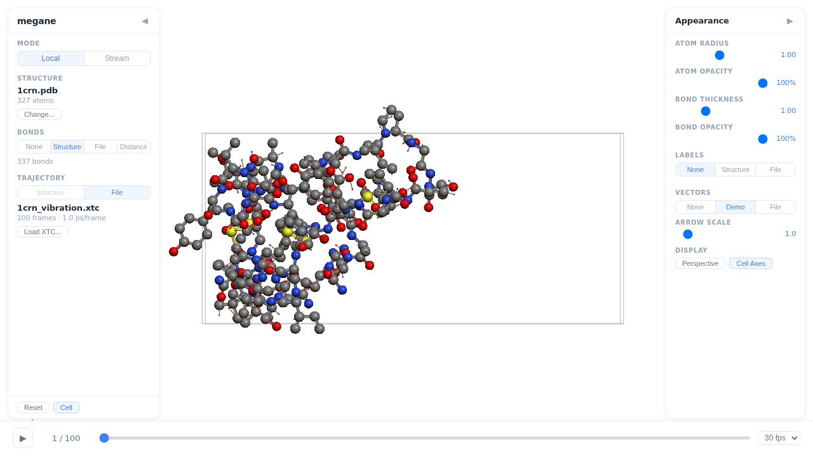

<h1 align="center">
  
  megane
</h1>

<p align="center">Desktop-grade molecular visualization. Right in your browser.</p>

<p align="center">
  <a href="https://github.com/hodakamori/megane/actions/workflows/ci.yml"></a>
  <a href="https://pypi.org/project/megane/"></a>
  <a href="https://www.npmjs.com/package/megane-viewer"></a>
  <a href="https://github.com/hodakamori/megane/blob/main/LICENSE"></a>
</p>

<p align="center">
  <a href="https://hodakamori.github.io/megane/">Docs</a> &middot;
  <a href="https://hodakamori.github.io/megane/getting-started">Getting Started</a> &middot;
  <a href="https://pypi.org/project/megane/">PyPI</a> &middot;
  <a href="https://www.npmjs.com/package/megane-viewer">npm</a>
</p>

<p align="center">
  
</p>

---

## Features

- **1M+ atoms at 60fps** — Billboard impostor rendering with WebGL handles massive protein complexes in real time
- **Jupyter, CLI, React** — Use as a Jupyter widget, serve from the command line, or embed the React component in your own app
- **Rust + WASM** — PDB, GRO, XYZ, MOL, and XTC parsers in Rust, shared between Python (PyO3) and browser (WASM)
- **Trajectory streaming** — Stream XTC trajectories over WebSocket in real time, scrub through thousands of frames
- **Atom selection & measurement** — Select 2–4 atoms to measure distances, angles, or dihedral angles
- **Adaptive rendering** — High-quality InstancedMesh for small systems, auto-switches to Billboard Impostor for large systems

## Installation

### Python

```bash
pip install megane
```

### npm (for React embedding)

```bash
npm install megane-viewer
```

## Quick Start

### Jupyter Notebook

```python
import megane

viewer = megane.MolecularViewer()
viewer.load("protein.pdb")
viewer  # display in cell

# With trajectory
viewer.load("protein.pdb", xtc="trajectory.xtc")
viewer.frame_index = 50
```

### CLI

```bash
megane serve protein.pdb
megane serve protein.pdb --xtc trajectory.xtc
megane serve  # upload from browser
```

### React

```tsx
import { MeganeViewer, parseStructureFile } from "megane-viewer";

function App() {
  const [snapshot, setSnapshot] = useState(null);

  const handleUpload = async (file: File) => {
    const result = await parseStructureFile(file);
    setSnapshot(result.snapshot);
  };

  return <MeganeViewer snapshot={snapshot} mode="local" /* ... */ />;
}
```

## Supported File Formats

| Format | Extension | Description |
|--------|-----------|-------------|
| PDB | `.pdb` | Protein Data Bank |
| GRO | `.gro` | GROMACS structure file |
| XYZ | `.xyz` | Cartesian coordinate format |
| MOL/SDF | `.mol`, `.sdf` | MDL Molfile (V2000) |
| XTC | `.xtc` | GROMACS compressed trajectory |

## Development

### Prerequisites

- Python 3.10+
- Node.js 18+
- Rust (for building the parser)
- [uv](https://docs.astral.sh/uv/)

### Setup

```bash
git clone https://github.com/hodakamori/megane.git
cd megane

# Python
uv sync --extra dev

# Node.js
npm install
npm run build
```

### Development Mode

```bash
# Terminal 1: Vite dev server
npm run dev

# Terminal 2: Python backend
uv run megane serve protein.pdb --dev --no-browser
```

### Tests

```bash
uv run pytest              # Python tests
npm test                   # TypeScript unit tests
cargo test -p megane-core  # Rust tests
make test-all              # All tests
```

## Project Structure

```
src/                     TypeScript frontend
  renderer/              Three.js rendering (impostor, mesh, shaders)
  protocol/              Binary protocol decoder + web workers
  parsers/               WASM-based file parsers (PDB, GRO, XYZ, MOL, XTC)
  logic/                 Bond / label / vector source logic
  components/            React UI components
  hooks/                 Custom React hooks
  stream/                WebSocket client
crates/                  Rust workspace
  megane-core/           Core parsers and bond inference
  megane-python/         PyO3 Python extension
  megane-wasm/           WASM bindings (wasm-bindgen)
python/megane/           Python backend
  parsers/               PDB / XTC parsers
  protocol.py            Binary protocol encoder
  server.py              FastAPI WebSocket server
  widget.py              anywidget Jupyter widget
tests/                   Tests (Python, TypeScript, E2E)
```

## License

[MIT](LICENSE)
