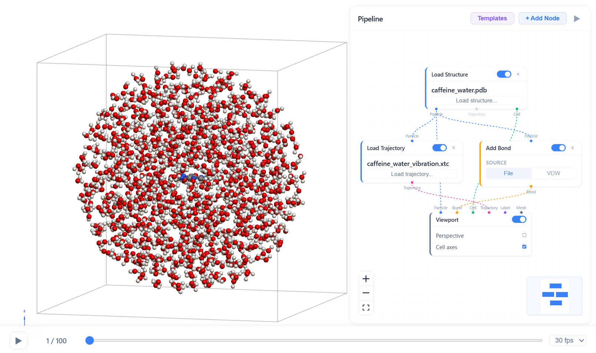
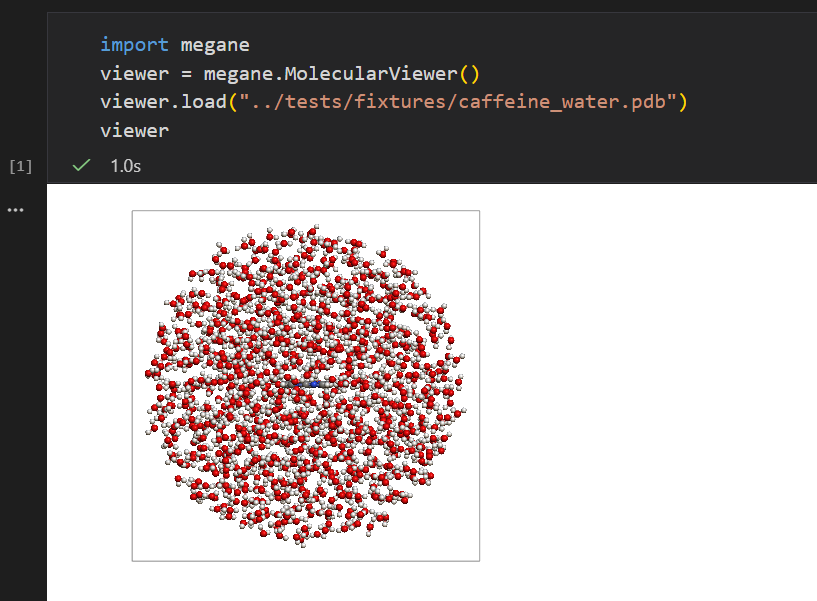
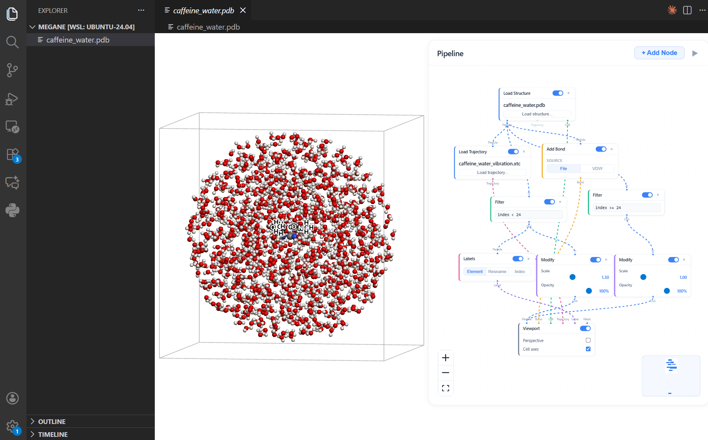
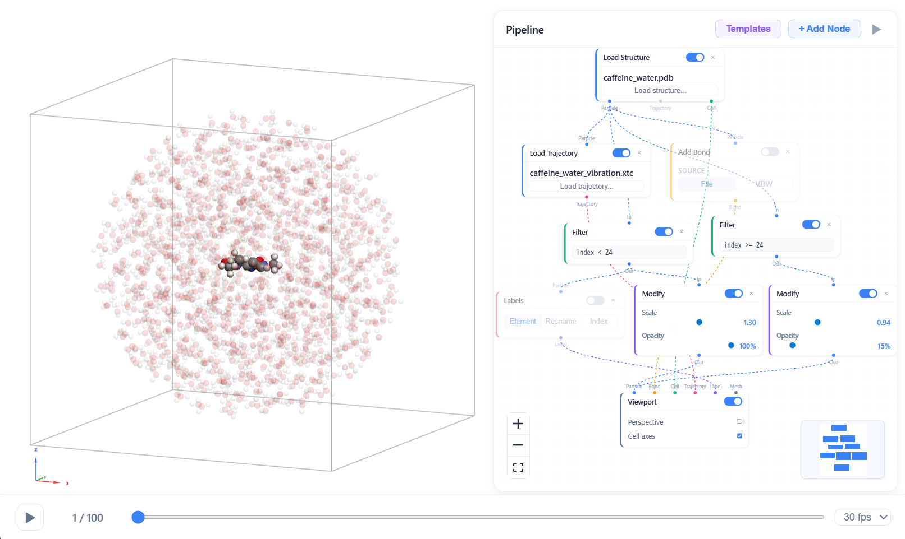
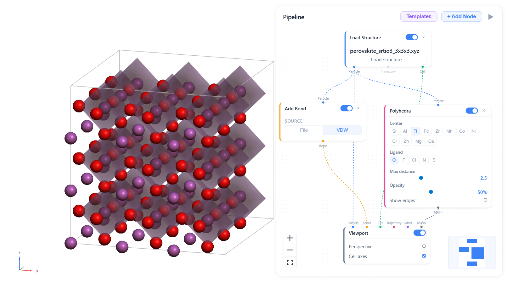

<h1 align="center">
  
  megane
</h1>

<p align="center">Spectacles for atomistic data.</p>
<p align="center"><em>1M+ atoms at 60fps. Visual pipelines. Jupyter, browser, React, VSCode.</em></p>

<p align="center">
  <a href="https://github.com/hodakamori/megane/actions/workflows/ci.yml"></a>
  <a href="https://pypi.org/project/megane/"></a>
  <a href="https://www.npmjs.com/package/megane-viewer"></a>
  <a href="https://github.com/hodakamori/megane/blob/main/LICENSE"></a>
</p>

<p align="center">
  <a href="https://hodakamori.github.io/megane/">Docs</a> &middot;
  <a href="https://hodakamori.github.io/megane/getting-started">Getting Started</a> &middot;
  <a href="https://pypi.org/project/megane/">PyPI</a> &middot;
  <a href="https://www.npmjs.com/package/megane-viewer">npm</a>
</p>

<p align="center">
  
</p>

---

## Features

- **1M+ Atoms at 60fps** — Billboard impostor rendering scales from small molecules to massive complexes in real time. InstancedMesh for small systems auto-switches to GPU-accelerated billboard impostors for large systems. Stream XTC trajectories over WebSocket.
- **Runs Everywhere** — Jupyter widget, CLI server, React component, and VSCode extension. Rust-based PDB, GRO, XYZ, MOL, and XTC parsers shared between Python (PyO3) and browser (WASM) — parse once, run anywhere.
- **Visual Pipeline Editor** — Build visualization workflows by wiring nodes. 8 node types (load, bond, filter, modify, labels, polyhedra, viewport) with 6 typed data channels (particle, bond, cell, label, mesh, trajectory) flowing through color-coded edges.
- **Embed & Integrate** — Control the viewer from Plotly via ipywidgets events. Embed in MDX / Next.js docs. React to `frame_change`, `selection_change`, and `measurement` events. Use the framework-agnostic renderer from Vue, Svelte, or vanilla JS.

### Scale

<p align="center">
  
</p>

megane renders over **1 million atoms at 60fps** in the browser. Small systems get high-quality InstancedMesh spheres and cylinders; large systems automatically switch to GPU-accelerated billboard impostors. No desktop app, no plugin — just a browser tab.

Trajectory streaming works over WebSocket via a binary protocol. Load an XTC file and scrub through thousands of frames in real time, without reading everything into memory.

### Anywhere

<p align="center">
  
  
</p>

One codebase, every environment.

| Environment | How | Install |
|---|---|---|
| **Jupyter** | anywidget inline viewer | `pip install megane` |
| **Browser** | `megane serve` local server | `pip install megane` |
| **React** | `<MeganeViewer />` component | `npm install megane-viewer` |
| **VSCode** | Custom editor for .pdb, .gro, .xyz | Extension |

The secret: PDB, GRO, XYZ, MOL, and XTC parsers are written in **Rust** and compiled to both **PyO3** (Python) and **WASM** (browser). Parse once, run anywhere.

### Visual Pipelines

<p align="center">
  
  
</p>

Wire nodes to build visualization workflows — no code required.

**8 node types** across 5 categories: load data, add bonds, filter atoms by query, modify scale and opacity per-group, generate labels, render coordination polyhedra, and display in a 3D viewport.

**6 typed data channels** — particle, bond, cell, label, mesh, trajectory — flow through color-coded edges. Only matching types can connect.

Pipelines serialize to JSON, so you can save, share, and version-control your visualization recipes.

### Integrate

megane is not a walled garden. It fits into your existing workflow.

**Plotly** — Click a point on a Plotly `FigureWidget` to jump to a trajectory frame. Use megane's `on_event("frame_change")` callback to update Plotly markers in sync.

**MDX / Next.js** — Drop `<MeganeViewer />` or `<Viewport />` into your `.mdx` documentation. WASM parsing works out of the box with a one-line webpack config.

**ipywidgets** — React to `frame_change`, `selection_change`, and `measurement` events. Compose megane with any widget in the Jupyter ecosystem.

**Framework-agnostic** — `MoleculeRenderer` is a plain Three.js class. Mount it in Vue, Svelte, or a vanilla `<div>`.

## Installation

### Python

```bash
pip install megane
```

### npm (for React embedding)

```bash
npm install megane-viewer
```

## Quick Start

### Jupyter Notebook

```python
import megane

viewer = megane.MolecularViewer()
viewer.load("protein.pdb")
viewer  # display in cell

# With trajectory
viewer.load("protein.pdb", xtc="trajectory.xtc")
viewer.frame_index = 50
```

### CLI

```bash
megane serve protein.pdb
megane serve protein.pdb --xtc trajectory.xtc
megane serve  # upload from browser
```

### React

```tsx
import { MeganeViewer, parseStructureFile } from "megane-viewer";

function App() {
  const [snapshot, setSnapshot] = useState(null);

  const handleUpload = async (file: File) => {
    const result = await parseStructureFile(file);
    setSnapshot(result.snapshot);
  };

  return <MeganeViewer snapshot={snapshot} mode="local" /* ... */ />;
}
```

## Supported File Formats

| Format | Extension | Description |
|--------|-----------|-------------|
| PDB | `.pdb` | Protein Data Bank |
| GRO | `.gro` | GROMACS structure file |
| XYZ | `.xyz` | Cartesian coordinate format |
| MOL/SDF | `.mol`, `.sdf` | MDL Molfile (V2000) |
| XTC | `.xtc` | GROMACS compressed trajectory |

## Development

### Prerequisites

- Python 3.10+
- Node.js 18+
- Rust (for building the parser)
- [uv](https://docs.astral.sh/uv/)

### Setup

```bash
git clone https://github.com/hodakamori/megane.git
cd megane

# Python
uv sync --extra dev

# Node.js
npm install
npm run build
```

### Development Mode

```bash
# Terminal 1: Vite dev server
npm run dev

# Terminal 2: Python backend
uv run megane serve protein.pdb --dev --no-browser
```

### Tests

```bash
uv run pytest              # Python tests
npm test                   # TypeScript unit tests
cargo test -p megane-core  # Rust tests
make test-all              # All tests
```

## Project Structure

```
src/                     TypeScript frontend
  renderer/              Three.js rendering (impostor, mesh, shaders)
  protocol/              Binary protocol decoder + web workers
  parsers/               WASM-based file parsers (PDB, GRO, XYZ, MOL, XTC)
  logic/                 Bond / label / vector source logic
  components/            React UI components
  hooks/                 Custom React hooks
  stream/                WebSocket client
crates/                  Rust workspace
  megane-core/           Core parsers and bond inference
  megane-python/         PyO3 Python extension
  megane-wasm/           WASM bindings (wasm-bindgen)
python/megane/           Python backend
  parsers/               PDB / XTC parsers
  protocol.py            Binary protocol encoder
  server.py              FastAPI WebSocket server
  widget.py              anywidget Jupyter widget
tests/                   Tests (Python, TypeScript, E2E)
```

## License

[MIT](LICENSE)
